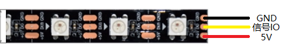

# Eletronic_design相关说明

## 硬件BOM

相关硬件BOM表，将EDA工程文件，导入立创EDA，可一键生成BOM。

## 元器件采购

- 立创商城采购

- Eletronic_design文档中有淘宝店铺的Excel表

## 其他说明

### 灯带说明

本项目采用的是WS2812B灯带，接口如下图：  

- 由于网上买到的灯带接口不统一，本人建议自己改线，PCB的led接口采用XH2.54母头插座，3Pin。如下图

- 推荐自行购买XH2.54公头线，焊接在灯带上即可，且和电机的插头形成统一
- 当然也可以自行焊接2.54mm排针，然后用arduino的杜邦线插上即可，这种接线可能会松，但也能用
- 关于WS2812灯带，宽度<=1cm，推荐裸灯带，不建议使用滴胶灯带，厚度可能不符合，未经验证  
