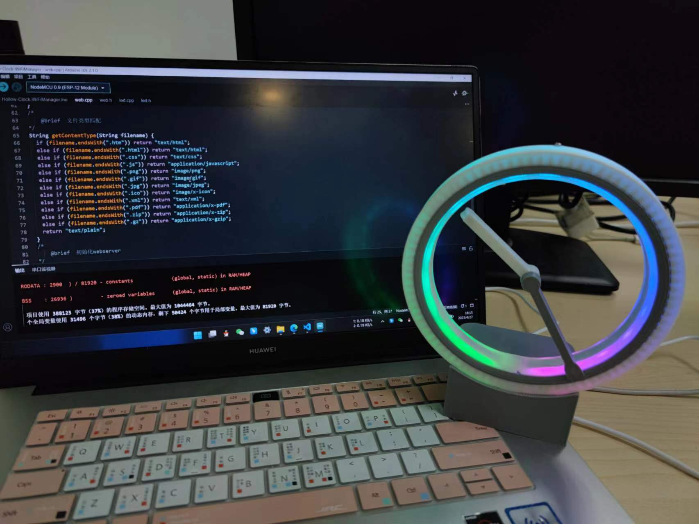
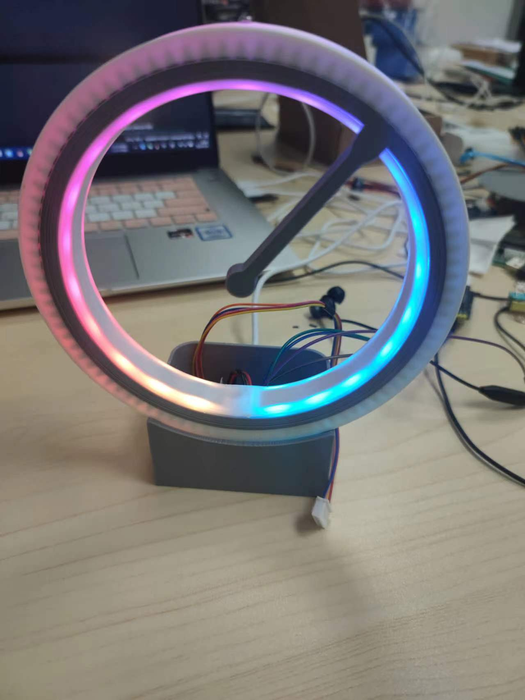

# Hollow-Clock-Pro

一款具有RGB，采用3D打印，指针悬浮的时钟

## 日志

- 2024/1/11：新增硬件描述，修改简介

## 声明 

该项目原作者为[shiura](https://www.youtube.com/@shiura/about)创作的作品[Hollow-Clock-4](https://www.instructables.com/Hollow-Clock-4/)  

**本项目基于原作的 CC-BY-NC-SA 4.0 协议 在原项目基础上做出改进，不用做商业用途，仅供学习参考使用**

## 简介

不得感叹原作本人的脑洞，原版的[Hollow-Clock-4](https://www.instructables.com/Hollow-Clock-4/)使用单片机自带时钟，存有一定时间误差，且其底座空间小，布局不合理。此项目在原有基础上做了一些改进。

### 功能说明

- wifi校时功能（第一次使用手动拨回12点）

- 新增WS18B20灯带，预置了3种灯效
- 新增了一键自动配网功能，链接时钟热点进行wifi配置
- 支持反转校时（结构问题，暂未使用）
- 新增网页界面控制时钟，可自行内置其他功能
- 新增OTA远程升级
- 重新绘制PCB
- 新外壳模型设计

### 注意事项

该项目没有采用电池供电方案，有需求的小伙伴请自行修改设计，因为电机功耗较大，常规3.7锂电池挺不了多久~

### 开发环境

|           主体           |  平台   |
| :----------------------: | :-----: |
| lower——>Hollow-Clock-Pro | Aruidno |
|   lower——>data——>html    | Vscode  |

## 文件说明

### 01documents

存放项目所有文档，表格，图片

### 02industial_design

存放3D模型文件等，[点击跳转文档说明](./01documents/02industrial_design_doc)

### 03electronic_design

项目EDA工程文件，[点击跳转文档说明](./01documents/03electronic_design_doc)

### 04lower

下位机工程文件，[点击跳转文档说明](./01documents/04lower_doc)

### 05upper

上位机工程文件，[点击跳转文档说明](./01documents/05upper_doc)

## 使用说明

- [演示视频，校时教程](https://www.bilibili.com/video/BV1DL41167Pf/?spm_id_from=333.999.list.card_archive.click&vd_source=2d5350a9e894031d65f0450846227793)  
- 如果你已经准备好了整套设备，并且已经组装完成，请参考[使用说明书，点击跳转](https://docs.qq.com/pdf/DS01uWlNuZ0xRZk10)

## 项目展示

## 赞助

如果你觉得这个项目对你有帮助，或者你有新的想法，欢迎你在此基础上继续创作  

并且情况允许的话，可以给我点一下star吗，总之非常感谢支持～

## License

This project is licensed under a [Creative Commons Attribution-NonCommercial-ShareAlike 4.0 International License](https://creativecommons.org/licenses/by-nc-sa/4.0/).

## 鸣谢

感谢嘉立创大大提供的免费PCB!

感谢[@魔光堂_来一点光](https://gitee.com/link?target=https%3A%2F%2Fspace.bilibili.com%2F65500598)提供wifi自主校时的思路